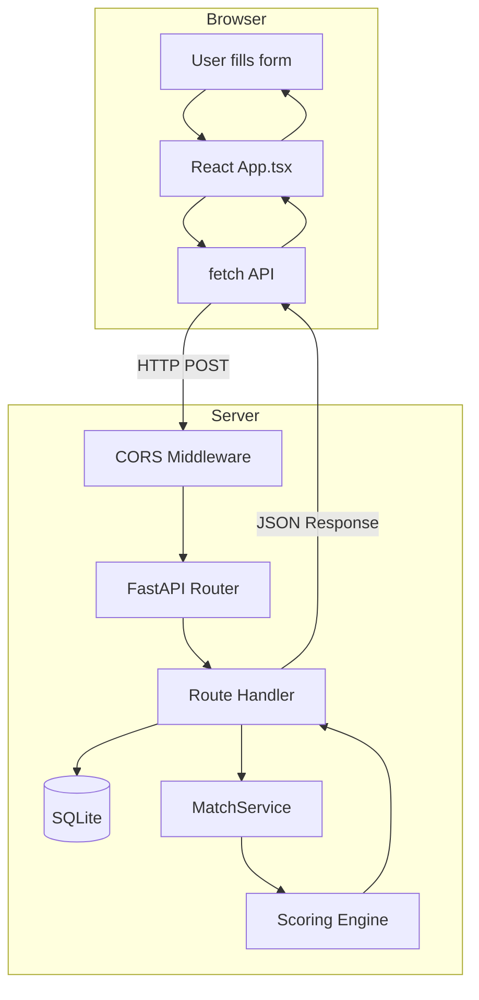
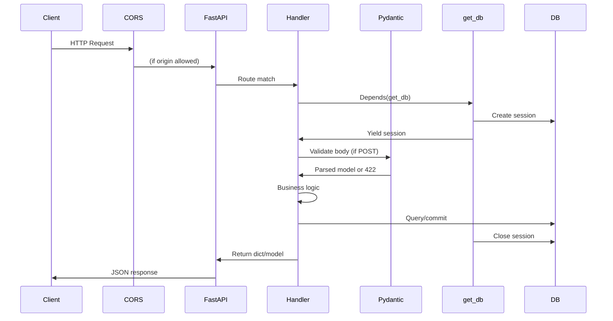

# ISKONNECT Engineering Handbook

A structured learning map to help you deeply understand the Philippine scholarship matching platform you built. This handbook explains concepts, architecture, and mental models—prioritizing intuition over syntax.

### Table of Contents

1. [High-Level System Architecture](#1-high-level-system-architecture) — Client/server, APIs, REST, request flow
2. [Complete Concept Inventory](#2-complete-concept-inventory) — 60+ concepts with definitions and project references
3. [Codebase Walkthrough](#3-codebase-walkthrough) — Directory structure and step-by-step data flow
4. [React Deep Understanding](#4-react-deep-understanding) — Components, hooks, state, re-renders
5. [Backend API Understanding](#5-backend-api-understanding) — FastAPI routing, lifecycle, endpoints
6. [Debugging Mental Models](#6-debugging-mental-models) — Symptom → diagnosis, common failure patterns
7. [Performance Concepts](#7-performance-concepts) — Caching, rate limiting, bottlenecks
8. [Developer Workflow](#8-developer-workflow-git--terminal) — Git and project-specific commands
9. [Engineering Intuition](#9-engineering-intuition) — Pattern recognition and debugging heuristics
10. [Knowledge Gaps](#10-knowledge-gaps) — What to study next and recommended path

---

## 1. High-Level System Architecture

### The Restaurant Analogy

Think of your application like a restaurant:

| Restaurant Part | Your System | What It Does |
|-----------------|------------|--------------|
| **Menu** | Frontend (React) | What the customer sees and interacts with. The student fills out a profile form and sees scholarship cards. |
| **Kitchen** | Backend (FastAPI) | Where the real work happens. The kitchen doesn't care who ordered—it just receives an order and cooks. |
| **Waiter** | API (REST endpoints) | Carries requests from the dining room to the kitchen and brings back the food. The waiter speaks a standard language (HTTP/JSON). |
| **Recipe** | Scoring Engine | The step-by-step logic that turns raw ingredients (profile + scholarships) into a finished dish (ranked matches). |
| **Pantry** | Database (SQLite) | Where ingredients are stored. Profiles and scholarships live here until needed. |

The customer (user) never goes into the kitchen. The kitchen never goes to the dining room. They communicate only through the waiter (API).

### How the Frontend Communicates with the Backend

Your frontend runs in the **browser** (client). Your backend runs on a **server** (your machine or a host). They are separate programs. The only way they talk is over the **network** using HTTP requests.

In `frontend/src/App.tsx` (lines 78–94), when the user submits the profile form:

1. The frontend calls `fetch()` with a URL like `http://localhost:8000/api/v1/profiles`
2. The browser sends an HTTP request over the network
3. The backend receives it, processes it, and sends back a response
4. The frontend receives the response and updates the screen

```
┌─────────────────┐                    ┌─────────────────┐
│    BROWSER      │   HTTP Request     │    SERVER       │
│  (localhost:    │  ───────────────>   │  (localhost:    │
│   5173)         │   POST /api/v1/    │   8000)         │
│                 │   profiles         │                 │
│  React App      │   + JSON body      │  FastAPI        │
│                 │                    │  + SQLite       │
│                 │  <───────────────  │                 │
│                 │   HTTP Response    │                 │
│                 │   + JSON body      │                 │
└─────────────────┘                    └─────────────────┘
```

### Request Flow Through the System



### Data Flow: From User Input to Results

1. **User fills form** → `ProfileForm` collects data in React state
2. **User clicks "Get My Matches"** → `handleSubmitProfile` runs in `App.tsx`
3. **FormData → JSON** → Profile object is built and `JSON.stringify(profile)` converts it to a string
4. **POST request** → `fetch()` sends the string to `POST /api/v1/profiles`
5. **Backend receives** → FastAPI parses JSON, validates with Pydantic, saves to SQLite
6. **Response** → Backend returns `{ id: 123, ... }` as JSON
7. **Second request** → Frontend immediately calls `GET /api/v1/matches/123`
8. **Match endpoint** → `get_matches` in `app/api/v1/matches.py` loads profile, loads scholarships, runs `MatchService.get_matches()`, returns ranked results
9. **Frontend receives** → `setMatches(matchData.matches)` updates state
10. **Re-render** → React shows `MatchResults` with `ScholarshipCard` components

### Responsibilities of Each Layer

| Layer | Responsibility | Example |
|-------|----------------|---------|
| **Frontend** | Display UI, collect input, show results, handle user interactions | `ProfileForm` validates required fields; `ScholarshipCard` shows match score |
| **API** | Receive requests, validate input, call business logic, return responses | `create_profile` validates `StudentProfile`, saves to DB, returns created profile |
| **Business Logic** | Core rules and algorithms | `MatchService` filters and scores; `WeightedDeterministicScorer` computes fitness |
| **Data Layer** | Persist and retrieve data | SQLAlchemy writes to `dev.db`; `get_profile_dict` reads a profile |

### Core Concepts Explained

**Client vs Server**
- **Client**: The program that initiates requests (your React app in the browser)
- **Server**: The program that listens for requests and responds (FastAPI on port 8000)
- They run in different processes, often on different machines in production

**API (Application Programming Interface)**
- A contract: "If you send me X, I'll send you Y"
- Your API says: "POST me a profile, I'll return the created profile with an ID"
- Think of it as a menu of available actions

**REST**
- A style of designing APIs using HTTP methods: GET (read), POST (create), PUT/PATCH (update), DELETE (remove)
- Your project uses: `GET /profiles`, `POST /profiles`, `GET /matches/{id}`, `GET /scholarships`
- URLs represent resources; methods represent actions

**Request Lifecycle**
1. Request leaves the client
2. Travels over the network
3. Server receives it
4. Server processes it (validation, DB, logic)
5. Server sends response
6. Client receives and handles it

**Serialization**
- Converting data structures to a format that can be sent over the wire (usually text)
- **JSON** (JavaScript Object Notation) is that format: `{"name": "Maria", "age": 18}`
- `JSON.stringify()` in JavaScript and FastAPI's automatic JSON response do this

**Statelessness**
- The server does not remember previous requests
- Each request carries everything needed (e.g., profile ID in the URL)
- No "session" or "memory" between requests—this makes scaling easier

---

## 2. Complete Concept Inventory

An exhaustive list of engineering concepts used in or closely related to this project.

### Frontend Concepts

| Concept | Definition | Intuition | Why It Exists | Where in This Project | When It Matters at Scale |
|---------|------------|-----------|---------------|----------------------|--------------------------|
| **Component** | A reusable, self-contained piece of UI | LEGO block—you combine them to build the app | Encapsulation; avoid one giant file | `ProfileForm`, `ScholarshipCard`, `Navbar`, etc. in `frontend/src/components/` | Large apps need hundreds of components; organization becomes critical |
| **Props** | Data passed from parent to child component | Instructions written on the LEGO box | One-way data flow; parent controls what child sees | `MatchResults` receives `matches` and `onReset`; `ScholarshipCard` receives `match` | Prop drilling (passing through many layers) becomes painful; consider context or state libraries |
| **State** | Data that changes over time and triggers re-renders | The component's personal notebook | UI must react to user input and async data | `useState` for `step`, `loading`, `error`, `matches` in `App.tsx` | Too much state in one place causes performance issues; split or lift carefully |
| **useState** | Hook that returns a value and a setter; updating triggers re-render | A variable that, when changed, tells React "redraw this" | React needs to know when to re-render | Every component with dynamic data uses it | Batching and optimization matter when many components update |
| **useEffect** | Hook that runs side effects (e.g., fetch) after render | "Do this after the component appears or when X changes" | Fetching, subscriptions, DOM manipulation | `ScholarshipList` fetches scholarships on mount with `useEffect` | Cleanup (e.g., `cancelled` flag) prevents memory leaks and stale updates |
| **useCallback** | Returns a memoized function; avoids recreating on every render | "Remember this function so child components don't re-render unnecessarily" | Performance; stable function reference for children | `handleSubmitProfile`, `resetToProfile`, etc. in `App.tsx` | Matters when passing callbacks to many children or to `useEffect` dependencies |
| **Controlled Input** | Input value is tied to React state; `onChange` updates state | React owns the input; you read from state, not the DOM | Single source of truth; validation and formatting | `ProfileForm` inputs: `value={values.full_name}` and `onChange` | Form libraries (React Hook Form, Formik) help with complex forms |
| **JSX** | Syntax that looks like HTML inside JavaScript | HTML-like tags that become function calls | Declarative UI; easier to read and write | All `.tsx` files: `<div>`, `<button>`, etc. | JSX is compiled away; no runtime cost |
| **TypeScript** | JavaScript with static types | Types are contracts; catch errors before runtime | Fewer bugs; better editor support | `types.ts` defines `StudentProfile`, `MatchResult`; all components use types | Large codebases benefit enormously from types |
| **Conditional Rendering** | Show different UI based on state | `{condition && <Component />}` or ternary | Dynamic UIs | `{step === "profile" && <ProfileForm />}` in `App.tsx` | Complex conditionals can be hard to follow; extract to variables or components |
| **Event Handling** | Functions that run when user acts (click, submit, change) | "When X happens, do Y" | Interactivity | `onSubmit={handleSubmitProfile}`, `onClick={() => setShowBreakdown(!showBreakdown)}` | Event delegation and batching matter for many elements |
| **FormData** | Browser API to read form fields by name | A key-value map of all form inputs | Easy extraction of form values | `new FormData(event.currentTarget)` in `App.tsx` | For complex forms, consider controlled inputs or form libraries |
| **Hidden Inputs** | `<input type="hidden" name="x" value={y} />` | Include data in form submit without showing it | Multi-step forms: keep previous steps' data | `ProfileForm` uses hidden inputs for fields on non-visible steps | Alternative: keep all data in state and submit from state |
| **Re-render** | React redrawing a component when state or props change | "Something changed; redraw this part of the tree" | React's core model | Every `setState` triggers re-render of that component and children | Too many re-renders cause jank; use `React.memo`, `useMemo`, `useCallback` |
| **Dependency Array** | Second argument of `useEffect`: list of values that trigger re-run | "Run this effect when any of these change" | Control when effects run | `useEffect(..., [])` in `ScholarshipList` = run once on mount | Wrong deps cause bugs (stale data) or infinite loops |
| **Tailwind CSS** | Utility-first CSS: classes like `rounded-lg`, `bg-primary-600` | Inline styling via class names | Fast styling; no context switching | All components use `className="..."` with Tailwind classes | Purge unused classes in production; design system for consistency |
| **Vite** | Build tool and dev server for frontend | Fast dev server; bundles for production | Speed; modern ES modules | `vite.config.ts`; `npm run dev` runs Vite | Vite replaces Webpack in many projects; understand its output |
| **HMR (Hot Module Replacement)** | Replace modules in browser without full reload | Edit code, see changes instantly | Developer experience | Vite provides this when you run `npm run dev` | HMR can sometimes leave stale state; full reload fixes it |
| **Environment Variables** | Config that varies by environment (dev, prod) | Secrets and URLs that shouldn't be in code | Security; flexibility | `VITE_API_BASE_URL` in `App.tsx` via `import.meta.env` | Never commit secrets; use different values per environment |

### Backend Concepts

| Concept | Definition | Intuition | Why It Exists | Where in This Project | When It Matters at Scale |
|---------|------------|-----------|---------------|----------------------|--------------------------|
| **FastAPI** | Python web framework for building APIs | A toolkit that handles HTTP, validation, docs | Speed; automatic OpenAPI docs; type hints | `app/main.py` creates the app; all routes use it | Async support for high concurrency; middleware for cross-cutting concerns |
| **Routing** | Mapping URL paths to handler functions | "When someone asks for /profiles, run this function" | Organize endpoints | `@router.get("/profiles")`, `@router.post("/profiles")` in `profiles.py` | Versioning (`/api/v1`, `/api/v2`); route parameters (`/matches/{id}`) |
| **APIRouter** | FastAPI object that groups related routes | A sub-menu of endpoints | Modularity | `router = APIRouter()` in each route file; `app.include_router(router, prefix="/api/v1")` | Large APIs split into many router modules |
| **Pydantic** | Library for data validation using Python type hints | "This data must look like this; reject or coerce otherwise" | Validate input; serialize output | `StudentProfile`, `MatchResponse` in `schemas.py` | Complex nested validation; custom validators |
| **SQLAlchemy** | Python ORM (Object-Relational Mapper) | Talk to the database using Python objects, not SQL strings | Type safety; migrations; connection pooling | `models.py` defines `Student`, `Scholarship`; `db.py` has engine and session | Connection pooling; transactions; migrations for schema changes |
| **ORM** | Maps database rows to Python objects | Rows become objects; you use `student.full_name` not `row["full_name"]` | Abstraction; less raw SQL | `db.query(models.Student).filter(...).all()` | N+1 queries; eager loading; query optimization |
| **Dependency Injection** | Framework provides dependencies (e.g., DB session) to handlers | "You need a DB session? I'll give you one." | Testability; clean separation | `get_db` in `db.py`; `db: Session = Depends(get_db)` in route handlers | Complex dependency graphs; testing with mocks |
| **CORS** | Cross-Origin Resource Sharing; browser security rule | "Can this site call that server?" | Browsers block cross-origin requests by default | `CORSMiddleware` in `main.py` allows `localhost:5173` | Production needs correct `allow_origins`; credentials for cookies |
| **Serialization** | Converting objects to a transmittable format (e.g., JSON) | Python dict → JSON string → send over network | APIs speak JSON, not Python objects | FastAPI auto-serializes responses; `json.dumps` for lists | Custom serializers; datetime handling; nested objects |
| **JSON** | Text format for structured data | `{"key": "value", "list": [1,2,3]}` | Universal; human-readable; language-agnostic | All API requests and responses use JSON | Size limits; parsing performance; schema validation |
| **HTTP Methods** | GET (read), POST (create), PUT/PATCH (update), DELETE (remove) | Verbs that describe the action | REST convention | `GET /profiles`, `POST /profiles`, `GET /matches/{id}` | Idempotency (GET, PUT, DELETE); POST for non-idempotent actions |
| **Status Codes** | 200 OK, 404 Not Found, 500 Server Error, etc. | Short-hand for "what happened" | Client can handle errors programmatically | `HTTPException(status_code=404, detail="Profile not found")` in `matches.py` | Consistent error handling; client retry logic |
| **Dataclass** | Python decorator for simple data containers | A struct with less boilerplate | Clean data structures | `ScoringPayload`, `ScoringResult` in `scoring_port.py` | Immutability; validation; conversion to/from dict |
| **Abstract Base Class (ABC)** | Class that defines interface; subclasses must implement | "Contract: you must have a `score` method" | Polymorphism; pluggable implementations | `ScoringEnginePort` in `scoring_port.py`; `WeightedDeterministicScorer` implements it | Multiple implementations; testing with mocks |

### Systems Concepts

| Concept | Definition | Intuition | Why It Exists | Where in This Project | When It Matters at Scale |
|---------|------------|-----------|---------------|----------------------|--------------------------|
| **Hard Filter** | Boolean pass/fail; fail = exclude | Deal-breaker: if you don't meet it, you're out | Eligibility rules (age, region, GWA) | `filter_scholarships` in `hard_filters.py` | Complex rules; performance (filter before expensive scoring) |
| **Soft Scoring** | Continuous score (0–100); rank by value | How well you fit, not just whether you qualify | Ranking; explainability | `WeightedDeterministicScorer` in `engine.py` | Tuning weights; A/B testing; fairness |
| **Weighted Average** | Sum of (component × weight); weights sum to 1 | Some factors matter more than others | Policy alignment | Academic 30%, Income 25%, Field 20%, etc. in `config.py` | Changing weights changes outcomes; document rationale |
| **Normalization** | Convert values to a common scale (e.g., 0–100) | Apples to apples: 1.25 (5.0 scale) vs 94% | Compare different grading systems | `normalize_gwa` in `gwa_normalizer.py` | Edge cases (different scales); missing data |
| **Deterministic** | Same input always produces same output | No randomness; reproducible | Debugging; fairness; audits | `WeightedDeterministicScorer`: same profile + scholarship → same score | Reproducibility for support and compliance |
| **Data Pipeline** | Sequence of transformations: input → process → output | Assembly line for data | Modularity; testability | Profile + Scholarships → Hard Filter → Scoring Payload → Score → Result | Each stage testable; add stages (e.g., caching) without rewriting |
| **Port/Adapter** | Interface (port) + implementation (adapter) | "Here's the contract; swap implementations" | Pluggable logic | `ScoringEnginePort` (interface); `WeightedDeterministicScorer` (adapter) | Swap scoring engines; test with mock scorer |

### Infrastructure Concepts

| Concept | Definition | Intuition | Why It Exists | Where in This Project | When It Matters at Scale |
|---------|------------|-----------|---------------|----------------------|--------------------------|
| **SQLite** | File-based database; no separate server | Database in a single file | Simplicity; zero config | `dev.db`; `sqlite:///./dev.db` in `db.py` | Not for high concurrency; use PostgreSQL/MySQL for production |
| **Virtual Environment** | Isolated Python package installation | Project-specific dependencies; no conflicts | Reproducibility | `venv/` folder; `pip install -r requirements.txt` | Different projects need different package versions |
| **Package Manager** | Tool to install and manage dependencies | "I need React; get it and its dependencies" | Dependency resolution | `npm` for frontend; `pip` for backend | Lock files (`package-lock.json`, `requirements.txt`) for reproducibility |
| **Build System** | Compiles/bundles source for production | Turn TSX + CSS into optimized JS + CSS | Performance; compatibility | Vite runs `vite build`; outputs to `frontend/dist/` | Tree-shaking; minification; code splitting |
| **Dev Server** | Serves app during development with hot reload | Fast feedback loop | Developer experience | `npm run dev` (Vite on 5173); `uvicorn --reload` (FastAPI on 8000) | Production uses different servers (e.g., Nginx, Gunicorn) |

### Developer Workflow Concepts

| Concept | Definition | Intuition | Why It Exists | Where in This Project | When It Matters at Scale |
|---------|------------|-----------|---------------|----------------------|--------------------------|
| **Git** | Version control system | Time machine for code; track changes | Collaboration; rollback; history | (If initialized) `.git` folder | Branches; merge strategies; rebasing |
| **Commit** | Snapshot of the codebase at a point in time | "Save game" with a message | Track progress; revert if needed | `git commit -m "Add scoring engine"` | Meaningful commit messages; atomic commits |
| **Branch** | Parallel line of development | Work on feature X without breaking main | Isolation; parallel work | `git branch feature-auth` | Branch strategies (GitFlow, trunk-based) |
| **Merge** | Combine two branches | Bring feature branch into main | Integrate work | `git merge feature-auth` | Merge conflicts; CI before merge |
| **Pull Request** | Proposal to merge a branch | "Review my changes before merging" | Code review; discussion | Used in team workflows | Automated checks; approval workflow |
| **Rebase** | Replay commits on top of another branch | "Pretend I started from latest main" | Linear history | `git rebase main` | Avoid rebasing shared branches |
| **Merge Conflict** | Same lines changed in both branches | "I changed this; you changed this; which wins?" | Manual resolution | `git status` shows conflicts | Communication; small, frequent merges reduce conflicts |

### Additional Concepts (Referenced or Implicit)

| Concept | Definition | Intuition | Where in This Project |
|---------|------------|-----------|----------------------|
| **Caching** | Store computed result for reuse | "We already computed this; use the saved answer" | Not implemented; would help scholarship list |
| **TTL** | Time-to-live; cache entry expires after X seconds | "This data is fresh for 5 minutes" | N/A |
| **Rate Limiting** | Limit requests per user/IP per time window | "Slow down; you're hitting us too hard" | Not implemented |
| **Debounce** | Delay action until user stops (e.g., typing) | "Wait until they stop typing before searching" | Not implemented; would help search |
| **Race Condition** | Outcome depends on timing of concurrent operations | "Who gets the last seat?" | Possible in `create_profile` upsert by email |
| **Memory Leak** | Memory not freed; grows over time | "We forgot to clean up" | `ScholarshipList` avoids with `cancelled` flag in useEffect cleanup |
| **Idempotency** | Doing it twice = same result as doing it once | "Safe to retry" | GET is idempotent; POST create may not be |
| **Connection Pool** | Reuse DB connections instead of opening new ones | "Keep connections warm" | SQLAlchemy can pool; SQLite is simpler |

---

## 3. Codebase Walkthrough

### Directory Structure (Annotated)

```
scholarship-match/
├── app/                          # Backend Python application
│   ├── api/v1/                   # API route handlers (version 1)
│   │   ├── matches.py            # GET /matches/{profile_id} - ranked scholarship matches
│   │   ├── profiles.py           # GET/POST /profiles - create and list student profiles
│   │   └── scholarships.py       # GET/POST /scholarships - list and create scholarships
│   ├── documents/
│   │   └── readiness.py          # Document readiness vs scholarship requirements
│   ├── matching/
│   │   ├── hard_filters.py       # Deal-breaker filters (age, region, GWA, etc.)
│   │   ├── match_service.py      # Orchestrates filter → score → rank
│   │   ├── scoring_port.py       # Interface for scoring engine (port/adapter)
│   │   ├── legacy_scorer.py      # Legacy rule-based scorer (adapter)
│   │   └── rules.py              # Old rule logic (used by legacy scorer)
│   ├── scoring/
│   │   ├── components.py         # Per-component score functions (0.0–1.0)
│   │   ├── config.py             # Weights, equity multipliers
│   │   ├── engine.py             # WeightedDeterministicScorer
│   │   └── explanation.py       # Build breakdown and plain-language explanation
│   ├── taxonomy/                 # Philippine-specific reference data
│   │   ├── equity_groups.py      # RA-based priority groups (PWD, IP, 4Ps, etc.)
│   │   ├── gwa_normalizer.py    # Normalize GWA to 0–100 scale
│   │   ├── income_brackets.py   # Income bracket mapping
│   │   ├── psced_fields.py      # Field of study taxonomy
│   │   └── regions.py           # Region normalization
│   ├── tests/                    # Pytest tests
│   ├── db.py                     # SQLAlchemy engine, session, get_db
│   ├── main.py                   # FastAPI app entry point
│   ├── models.py                 # SQLAlchemy ORM models (Student, Scholarship)
│   └── schemas.py                # Pydantic request/response schemas
├── frontend/
│   ├── src/
│   │   ├── components/           # React components
│   │   │   ├── Footer.tsx
│   │   │   ├── HeroSection.tsx
│   │   │   ├── MatchResults.tsx   # Displays ranked matches
│   │   │   ├── Navbar.tsx
│   │   │   ├── NeedsCategoryAccordion.tsx
│   │   │   ├── ProfileForm.tsx    # 5-step profile wizard
│   │   │   ├── ScholarshipCard.tsx # Single match card with breakdown
│   │   │   ├── ScholarshipList.tsx # Browse all scholarships
│   │   │   └── SelectedChips.tsx
│   │   ├── constants/
│   │   │   └── needsCategories.ts # NEEDS_CATEGORIES, EQUITY_GROUPS, INCOME_BRACKETS
│   │   ├── types.ts              # TypeScript interfaces (StudentProfile, MatchResult)
│   │   ├── App.tsx               # Root component; step state; API calls
│   │   └── main.tsx              # React entry point
│   ├── index.html
│   ├── package.json
│   ├── vite.config.ts
│   └── tailwind.config.js
├── seed_data.py                  # Seeds dev.db with 22 scholarships
├── requirements.txt              # Python dependencies
├── start.py                      # Launches uvicorn
├── start-backend.bat             # Windows: run backend
├── dev.db                        # SQLite database (created at runtime)
├── README.md
└── SCORING_ENGINE.md             # Scoring design documentation
```

### Key File Responsibilities

| File | Responsibility |
|------|-----------------|
| `app/main.py` | Creates FastAPI app, adds CORS, registers routers, creates DB tables on startup |
| `app/db.py` | SQLite engine, session factory, `get_db` dependency (yields session, closes on done) |
| `app/models.py` | `Student` and `Scholarship` table definitions (SQLAlchemy) |
| `app/schemas.py` | `StudentProfile`, `MatchResponse`, etc. (Pydantic validation and serialization) |
| `app/api/v1/profiles.py` | Create/update profile by email, list profiles, get by ID; GWA normalization, income bracket |
| `app/api/v1/matches.py` | Load profile, load scholarships, call MatchService, return ranked matches |
| `app/api/v1/scholarships.py` | List active scholarships, create scholarship |
| `app/matching/match_service.py` | Filter → build payload → score → build result → sort by final_score |
| `app/matching/hard_filters.py` | Age, level, region, school type, income, GWA, field—all must pass |
| `app/scoring/engine.py` | Compute 6 components, weighted sum, equity multiplier, breakdown, explanation |
| `frontend/src/App.tsx` | Step state (profile/results/scholarships), form submit handler, API calls, navigation |
| `frontend/src/components/ProfileForm.tsx` | 5-step wizard, controlled inputs, hidden fields, equity checkboxes |
| `frontend/src/components/ScholarshipCard.tsx` | Display match, score badge, expandable "Why you matched" breakdown |

### Step-by-Step: Primary User Journey

**1. User opens the website**

- Browser requests `http://localhost:5173`
- Vite dev server serves `index.html`
- `main.tsx` mounts React; `App` component renders
- `step` is `"profile"`, so `HeroSection` and `ProfileForm` are shown

**2. User fills the 5-step profile form**

- `ProfileForm` holds `values` in state; each input is controlled (`value={values.x}`, `onChange`)
- "Next" advances `step`; "Back" decrements it
- Fields on non-visible steps are kept via hidden inputs so all data is in the form on submit

**3. User clicks "Get My Matches"**

- Form `onSubmit` calls `handleSubmitProfile` in `App.tsx`
- `event.preventDefault()` stops default form submit
- `FormData` is built from the form; helper functions (`getStr`, `getNum`, `getBool`, `getList`) extract values
- A `StudentProfile` object is built and sent as `JSON.stringify(profile)` in the request body

**4. POST /api/v1/profiles**

- Request hits FastAPI; CORS middleware allows it (origin localhost:5173)
- Route `create_profile` in `profiles.py` matches
- Pydantic validates body as `StudentProfile`
- `_profile_to_db_dict` converts to DB format (GWA normalized, income bracket derived)
- If email exists: update existing row; else: insert new `Student`
- Response: `{ id: 123, full_name: "...", ... }`

**5. GET /api/v1/matches/123**

- Frontend immediately calls this with the profile ID from the previous response
- `get_matches` in `matches.py` runs
- `get_profile_dict(123, db)` loads profile as dict
- `db.query(models.Scholarship).filter(is_active != False).all()` loads all active scholarships
- `_scholarship_to_dict` converts each to dict
- `match_service.get_matches(profile, scholarship_dicts)` runs:
  - `filter_scholarships(profile, scholarships)` → candidates that pass all hard filters
  - For each candidate: `_build_scoring_payload(profile, sch)` → `ScoringPayload`
  - `scoring_engine.score(payload)` → `ScoringResult` (score, breakdown, explanation)
  - `_build_match_result(sch, scoring_result)` → match dict
  - Sort by `final_score` descending
- Response: `{ matches: [ {...}, {...}, ... ] }`

**6. Frontend receives and displays results**

- `setMatches(matchData.matches)` updates state
- `setStep("results")` switches view
- `MatchResults` renders; maps over `matches` and renders `ScholarshipCard` for each
- Each card shows score, deadline, benefits, and expandable "Why you matched" breakdown

### Where Data Enters and Leaves

| Data | Enters | Leaves |
|------|--------|--------|
| **Student profile** | User fills `ProfileForm` → `POST /profiles` | Stored in `students` table; returned in `matches` response |
| **Scholarships** | `seed_data.py` inserts into `scholarships` table | `GET /scholarships` (browse list); `GET /matches` (included in match results) |
| **Match results** | Computed in `MatchService.get_matches` | `GET /matches/{id}` → JSON → `MatchResults` + `ScholarshipCard` |

---

## 4. React Deep Understanding

### Components

A **component** is a self-contained piece of UI. Think of it as a LEGO block: it has a shape (what it renders), it can receive instructions (props), and it can have internal state (its own memory).

In this project, `App` is the root. It composes `Navbar`, `HeroSection`, `ProfileForm`, `MatchResults`, `ScholarshipList`, and `Footer`. Each does one job.

### Props

**Props** are data passed from parent to child. They flow **down** only. The parent decides what the child sees.

Example: `MatchResults` receives `matches` and `onReset`:

```tsx
<MatchResults matches={matches} onReset={resetToProfile} />
```

Inside `MatchResults`, you use `matches` to render cards and `onReset` when the user clicks "Start new profile." The child cannot change props directly; it calls the callback to ask the parent to change state.

### State

**State** is data that changes over time and lives inside a component. When state changes, React re-renders that component (and its children).

In `App.tsx`:
- `step` — which screen to show (profile, results, scholarships)
- `loading` — whether an API call is in progress
- `error` — error message to display
- `matches` — the ranked scholarship results

When `setMatches(data)` runs, React re-renders `App`, and `MatchResults` receives the new `matches` as a prop.

### Hooks

**Hooks** are functions that give components extra capabilities. They always start with `use`.

- **useState**: "I need a value that changes; when it changes, re-render."
- **useEffect**: "Run this code after render (or when these deps change)."
- **useCallback**: "Remember this function so I don't create a new one every render."

### useEffect Deep Dive

`useEffect` runs **after** the component renders. It's for side effects: fetching data, subscribing, DOM manipulation.

In `ScholarshipList.tsx`:

```tsx
useEffect(() => {
  let cancelled = false;
  setLoading(true);
  fetch(`${API_BASE_URL}/api/v1/scholarships`)
    .then(res => res.json())
    .then(data => {
      if (!cancelled) setScholarships(data);
    })
    .finally(() => {
      if (!cancelled) setLoading(false);
    });
  return () => { cancelled = true; };  // Cleanup
}, []);
```

- **Empty dependency array `[]`**: Run once when the component mounts.
- **Cleanup function** (`return () => { cancelled = true }`): Runs when the component unmounts (or before the effect re-runs). If the user navigates away before the fetch completes, the `.then` callback would still run and call `setScholarships`. That would update state on an unmounted component—a React warning and potential bug. Setting `cancelled = true` prevents the callback from calling `setState`.

### Re-renders

A **re-render** happens when:
1. The component's state changes (`setState`)
2. The component's props change (parent re-rendered with new props)
3. The component's parent re-rendered (children re-render by default)

React only re-renders the subtree that changed. It does not re-run the whole app.

### Dependency Arrays

The second argument of `useEffect` is the dependency array:

- `[]` — run once on mount
- `[userId]` — run when `userId` changes
- Omitted — run after every render (usually a bug)

**Infinite loop trap**: If your effect calls `setState` and that state is in the dependency array, you get: render → effect runs → setState → re-render → effect runs again → infinite loop.

**Stale closure**: If you omit a dependency, the effect may use an old value. Example: effect depends on `profileId` but you put `[]`—the effect never sees updated `profileId`.

### useCallback in This Project

In `App.tsx`, handlers are wrapped in `useCallback`:

```tsx
const handleSubmitProfile = useCallback(async (event) => { ... }, []);
const resetToProfile = useCallback(() => {
  setStep("profile");
  setMatches([]);
  setError(null);
}, []);
```

- **Empty deps `[]`**: The function is created once and never changes.
- **Why**: These handlers are passed to children (`ProfileForm`, `Navbar`, `MatchResults`). Without `useCallback`, a new function would be created every render, and React would think the prop changed—triggering unnecessary re-renders of children. With `useCallback`, the reference is stable.

**Stale closure note**: `handleSubmitProfile` has `[]` deps but uses `setMatches`, `setStep`, `setError`. That's fine because React guarantees `setState` functions are stable. You're not closing over changing values.

### Why Components Are Structured This Way

| Component | Pattern | Reason |
|-----------|---------|--------|
| **ProfileForm** | Local state + hidden inputs | Multi-step wizard: only one step visible, but all data must be in the form on submit. Hidden inputs keep previous steps' values. |
| **App** | useCallback for handlers | Handlers passed to many children; stable references avoid unnecessary re-renders. |
| **ScholarshipList** | useEffect + cancelled flag | Fetch on mount; cleanup prevents setState after unmount (user navigated away). |
| **ScholarshipCard** | Local state for showBreakdown | Expand/collapse is local to each card; no need to lift state to parent. |
| **MatchResults** | Pure presentation | Receives `matches` and `onReset`; no fetching. Easy to test and reuse. |

### Infinite Loops: How They Happen

1. **useEffect with missing or wrong deps**: Effect calls `setState`; state is in deps → effect runs again → loop.
2. **Object/array in deps**: `useEffect(..., [someObject])` — objects are compared by reference. If the parent creates `someObject` inline each render, it's a new reference every time → effect runs every render.
3. **State in render**: Never do `setState` during render (only in event handlers or effects). That would cause render → setState → render → setState → loop.

### Stale Closures

A **closure** is when a function "remembers" variables from where it was created. A **stale closure** is when it remembers an old value.

Example: A `useEffect` with `[]` that uses `userId` from props. If `userId` changes, the effect doesn't re-run, so it still has the old `userId`. Fix: add `userId` to the dependency array.

In this project, `handleSubmitProfile` uses `setMatches`, `setStep`, etc. Those are stable. It doesn't close over any changing values, so `[]` is correct.

---

## 5. Backend API Understanding

### FastAPI Routing

FastAPI uses **routers** to group endpoints. In `main.py`:

```python
app.include_router(profiles.router, prefix="/api/v1")
app.include_router(scholarships.router, prefix="/api/v1")
app.include_router(matches.router, prefix="/api/v1")
```

Each router defines routes with decorators. The prefix is prepended, so:
- `profiles.router` with `@router.get("/profiles")` → `GET /api/v1/profiles`
- `matches.router` with `@router.get("/matches/{profile_id}")` → `GET /api/v1/matches/123`

Path parameters like `{profile_id}` become function arguments: `def get_matches(profile_id: int, ...)`.

### Request Lifecycle



1. **HTTP request** arrives (e.g., `POST /api/v1/profiles` with JSON body).
2. **CORS middleware** checks `Origin` header. If not in `allow_origins`, response is blocked.
3. **Route matching**: FastAPI finds the handler for that method and path.
4. **Dependency resolution**: `get_db` is called; it creates a session, yields it to the handler, then closes it in a `finally` block.
5. **Request body validation**: For POST, FastAPI parses JSON and validates against the Pydantic model (e.g., `StudentProfile`). Invalid data → 422 Unprocessable Entity.
6. **Handler runs**: Your code executes (e.g., save to DB, call MatchService).
7. **Response**: Return a dict or Pydantic model; FastAPI serializes to JSON.

### Data Validation

Pydantic models define the shape of data. In `schemas.py`:

```python
class StudentProfile(BaseModel):
    full_name: str
    email: str
    age: Optional[int] = None
    region: Optional[str] = None
    # ... many more fields
```

- `full_name` and `email` are required (no default).
- `age`, `region`, etc. are optional (default `None`).
- FastAPI validates the JSON body against this. Wrong types (e.g., string for `age`) → 422 with error details.

### How Python Objects Become JSON

FastAPI automatically serializes return values:
- **Dict**: Converted to JSON directly.
- **Pydantic model**: Uses `.model_dump()` (or `.dict()` in older Pydantic) to get a dict, then JSON.
- **List of models**: Each item serialized the same way.

Dates (e.g., `application_deadline`) need special handling. In `match_service._build_match_result`, you see:

```python
"application_deadline": (
    scholarship.get("application_deadline").isoformat()
    if hasattr(scholarship.get("application_deadline"), "isoformat")
    else scholarship.get("application_deadline")
)
```

Python `date` objects aren't JSON-serializable by default. Converting to ISO string (`"2025-03-15"`) makes them valid JSON.

### Dependency Injection: get_db

In `db.py`:

```python
def get_db():
    db = SessionLocal()
    try:
        yield db
    finally:
        db.close()
```

And in a route:

```python
def create_profile(profile: schemas.StudentProfile, db: Session = Depends(get_db)):
```

FastAPI calls `get_db()` before the handler. The `yield` gives `db` to the handler. When the handler finishes, execution resumes after `yield`, and `finally` runs—closing the session. This ensures connections are always released, even if the handler raises.

Think of it as a tool belt: FastAPI hands you a DB session when you need it and takes it back when you're done.

### Why APIs Are Stateless

The server does not store session state between requests. Each request is independent:
- No "current user" stored in memory.
- The client sends everything needed (e.g., profile ID in the URL).
- Two identical requests produce the same response.

Benefits: easy to scale (add more servers), no session storage, simpler reasoning about behavior.

### Endpoint Walkthrough

| Endpoint | Method | Handler | What It Does |
|----------|--------|---------|--------------|
| `/health` | GET | `health` in `main.py` | Returns `{"status": "ok"}`. Used for health checks. |
| `/api/v1/profiles` | GET | `list_profiles` | Queries all `Student` rows, converts to response dicts. |
| `/api/v1/profiles` | POST | `create_profile` | Validates body as `StudentProfile`. Upserts by email (update if exists, else insert). Returns created/updated profile with ID. |
| `/api/v1/profiles/{profile_id}` | GET | `get_profile` | Loads profile by ID; 404 if not found. |
| `/api/v1/scholarships` | GET | `list_scholarships` | Returns active scholarships. |
| `/api/v1/scholarships` | POST | `create_scholarship` | Creates a new scholarship (admin use). |
| `/api/v1/matches/{profile_id}` | GET | `get_matches` | Loads profile and scholarships, runs `MatchService.get_matches`, returns ranked matches. 404 if profile not found. |

### The Matches Endpoint in Detail

```python
@router.get("/matches/{profile_id}")
def get_matches(profile_id: int, db: Session = Depends(get_db)):
    profile = get_profile_dict(profile_id, db)
    if not profile:
        raise HTTPException(status_code=404, detail="Profile not found")

    scholarships = db.query(models.Scholarship).filter(
        models.Scholarship.is_active != False
    ).all()
    scholarship_dicts = [_scholarship_to_dict(s) for s in scholarships]

    results = match_service.get_matches(profile, scholarship_dicts)
    # ... backward compatibility for score/final_score
    return {"matches": results}
```

1. Load profile as dict (for matching logic, which expects dicts).
2. Load all active scholarships, convert to dicts.
3. `MatchService.get_matches` filters, scores, ranks.
4. Return `{"matches": [...]}`.

The matching logic is intentionally decoupled from the route: it receives plain dicts, so it can be tested without a database.

---

## 6. Debugging Mental Models

### Symptom → Diagnosis Table

| Symptom | Likely Cause | Where to Look |
|---------|--------------|---------------|
| "CORS error" in browser console | Frontend (localhost:5173) calling backend (localhost:8000); browser blocks | `main.py` CORS `allow_origins`—add your frontend URL |
| "Network Error" or "Failed to fetch" | Backend not running, wrong URL, or firewall | Is uvicorn running? Is `VITE_API_BASE_URL` correct? |
| "Profile not found" (404) | Profile ID doesn't exist or was never created | Check POST /profiles succeeded; log `created.id` |
| Matches always empty | All scholarships filtered out by hard filters | `hard_filters.py`—profile may fail age, region, level, income, GWA, or field |
| All scores ~50 or same value | Scoring components getting neutral/default values | Check `_build_scoring_payload`; are `field_match_level`, `geographic_match_level` correct? GWA/income reaching scorer? |
| Form submits but nothing happens | JS error before setState; or API returns error | Browser DevTools Console; Network tab for response |
| "Unable to create profile" | Validation error (422) or DB error | Network tab: response body has `detail` with validation errors |
| Scholarships list empty | DB not seeded or `is_active` filter | Run `python seed_data.py`; check `scholarships` table |
| UI shows old data after navigation | Stale state; component didn't unmount/remount | Check step state; does "Start new profile" call `resetToProfile`? |
| Infinite re-renders / browser freeze | useEffect setState loop or state update in render | Check useEffect deps; ensure no setState during render |

### Race Conditions

**What**: Outcome depends on timing of concurrent operations.

**In this project**: `create_profile` upserts by email. If two requests with the same email arrive at once, both might read "no existing," both insert, and you get a duplicate key error (email is unique). Or one overwrites the other.

**When it matters**: Under load. Locally, rare. Mitigation: use DB transactions and unique constraints; consider "last write wins" or optimistic locking.

### API Failures

**CORS**: The #1 beginner issue. Browser blocks responses when origin isn't allowed. Fix: add your frontend origin to `allow_origins` in `main.py`.

**Network failures**: Backend down, wrong port, VPN/firewall. Check backend is running and reachable.

**JSON parse errors**: Response isn't valid JSON. Maybe the server returned HTML (500 error page) or plain text. Inspect response in Network tab.

### Stale Caches

This project has no caching. If you add it later: stale cache = old data shown after source changed. Invalidate on write (e.g., when scholarships are updated) or use TTL.

### Memory Leaks

**What**: Memory not freed; grows over time.

**In React**: Updating state on an unmounted component. Example: fetch completes after user navigated away, callback calls `setState` → warning and leak.

**This project's fix**: `ScholarshipList` uses a `cancelled` flag. Cleanup sets `cancelled = true`; the fetch callback checks it before calling `setState`.

### Connection Pool Exhaustion

SQLite in this project uses one connection per request via `get_db`. With many concurrent requests, you could hit limits. SQLite isn't ideal for high concurrency; PostgreSQL with a connection pool is. For now, low traffic makes this unlikely.

### Slow Queries

If matches endpoint is slow: loading all scholarships and scoring each is O(n) per request. With 22 scholarships it's fine. With 10,000, you'd need pagination, caching, or precomputation.

### Frontend State Bugs

- **Form not resetting**: "Start new profile" should clear `matches` and `error` and set `step` to `"profile"`. If the form still shows old data, it's because `ProfileForm` keeps its own `values` state—you may need to add a `key` prop that changes on reset to force remount.
- **Stale state after navigation**: Ensure parent state (`step`, `matches`) is updated correctly when switching views.

### Infinite Re-renders

1. **useEffect with setState and wrong deps**: Effect runs → setState → re-render → effect runs again. Fix: correct dependency array or move setState elsewhere.
2. **Object/array in deps**: `[{}]` creates new object every render → effect runs every render. Fix: use primitive values or `useMemo`.
3. **setState during render**: Never. Only in event handlers or effects.

---

## 7. Performance Concepts

### Caching

**What**: Store a computed result and reuse it instead of recomputing.

**Why**: Computation or I/O is expensive; if the same request or data is needed again, serve from cache.

**In this project**: The scholarship list changes rarely. `GET /api/v1/scholarships` could be cached for minutes. Match results depend on the profile, so they're harder to cache unless you cache per profile ID with a short TTL.

**Where to add**: Backend (in-memory or Redis) or frontend (e.g., store scholarships in state and don't refetch on every "Browse" visit).

### TTL (Time-to-Live)

**What**: How long a cache entry is valid before it's considered stale.

**Why**: Balance freshness vs load. Too short = little benefit. Too long = stale data.

**Example**: Cache scholarship list for 5 minutes. After 5 minutes, next request recomputes and refreshes cache.

### Cache Invalidation

**What**: Deciding when to remove or refresh cached data.

**Why**: When the source changes (e.g., new scholarship added), cache must be updated.

**Strategies**:
- **TTL only**: Let entries expire. Simple but can serve stale data.
- **Invalidate on write**: When you add/update a scholarship, clear the scholarships cache.
- **Version/key**: Include a version in the cache key; bump version when data changes.

### Rate Limiting

**What**: Limit how many requests a client can make per time window (e.g., 100/minute).

**Why**: Protect the server from abuse, DDoS, or buggy clients.

**In this project**: Not implemented. A malicious client could hammer the matches endpoint. Add rate limiting (e.g., slowapi, or a reverse proxy) before production.

### Debouncing

**What**: Delay an action until the user has stopped doing something for X ms (e.g., typing).

**Why**: Avoid running expensive logic on every keystroke.

**Example**: Search box. User types "engineering"—without debounce, you'd search on "e", "en", "eng", ... With 300ms debounce, you search once after they stop typing.

**In this project**: No search yet. If you add a filter/search, debounce the input.

### Throttling

**What**: Allow at most N actions per time window (e.g., 1 request per second).

**Why**: Similar to rate limiting but often applied to user actions (e.g., button clicks).

**Example**: "Get My Matches" could be throttled so double-clicks don't trigger two requests.

### Batching

**What**: Combine multiple operations into one (e.g., one DB query instead of N).

**Why**: Reduce round-trips and overhead.

**In this project**: Match endpoint loads all scholarships in one query. Good. If you had N+1 queries (one per scholarship for extra data), you'd batch or use eager loading.

### Lazy Loading

**What**: Load data or render components only when needed (e.g., when scrolled into view).

**Why**: Initial load is faster; you don't fetch/render everything upfront.

**In this project**: All match cards render at once. With hundreds of matches, you could virtualize the list (render only visible cards) or paginate.

### Current Bottleneck Analysis

| Operation | Cost | Bottleneck? |
|-----------|------|-------------|
| Load profile | 1 DB query | No |
| Load scholarships | 1 DB query (all rows) | No at 22; yes at 10,000+ |
| Hard filter | O(n) over scholarships | No |
| Scoring | O(n) × (6 components + equity + explanation) | No at 22; yes at 1000+ |
| JSON serialization | O(n) for matches | No |
| Frontend render | O(n) ScholarshipCards | No at 22; consider virtualization at 500+ |

**Summary**: The scoring engine runs synchronously for every scholarship on every request. With 22 scholarships it's fine. To scale: cache match results per profile, precompute scores in background, or paginate/limit results.

---

## 8. Developer Workflow (Git + Terminal)

### Git Commands

| Command | What It Does | When to Use | What Could Go Wrong |
|---------|--------------|-------------|---------------------|
| `git clone <url>` | Copy a repo from remote to your machine | First time getting a project | Wrong URL; no network; auth fails |
| `git pull` | Fetch and merge changes from remote | Before starting work; to get teammates' changes | Merge conflicts if you have local changes |
| `git push` | Send your commits to remote | After committing; to share your work | Rejected if remote has new commits (pull first) |
| `git fetch` | Download remote changes without merging | To see what's new without applying it | Safe; no local changes |
| `git branch` | List branches; `git branch feature-x` creates one | See current branch; create feature branch | N/A |
| `git checkout <branch>` | Switch to a branch | Move between branches | Uncommitted changes may block; stash first |
| `git merge <branch>` | Merge another branch into current | Integrate feature into main | Merge conflicts; resolve in files |
| `git rebase <branch>` | Replay your commits on top of another branch | Clean linear history | Don't rebase shared branches; can be confusing |
| `git status` | Show modified, staged, untracked files | Before commit; to see state | N/A |
| `git log` | Show commit history | See what changed; find a commit | Use `--oneline` for compact view |

### Project-Specific Commands

| Command | What It Does | When to Use | What Could Go Wrong |
|---------|--------------|-------------|---------------------|
| `pip install -r requirements.txt` | Install Python dependencies | After cloning; when deps change | Wrong Python version; permission errors |
| `python -m venv venv` | Create virtual environment | First-time setup | Overwrites existing venv if you reuse name |
| `venv\Scripts\activate` (Windows) | Activate virtual environment | Before running Python/uvicorn | Forgot to activate; using system Python |
| `python seed_data.py` | Seed database with scholarships | First run; after deleting dev.db | DB locked; path issues |
| `uvicorn app.main:app --reload --port 8000` | Start FastAPI backend | Development | Port in use; import errors |
| `cd frontend && npm install` | Install Node dependencies | After cloning; when package.json changes | Network issues; node version |
| `npm run dev` | Start Vite dev server (frontend) | Development | Port 5173 in use |
| `npm run build` | Build frontend for production | Before deploying | Build errors; check console |

### Virtual Environments

**What**: Isolated Python environment per project. Each project has its own `site-packages` (installed packages).

**Why**: Project A needs FastAPI 0.100, Project B needs 0.110. Without venv, they conflict.

**How**:
```bash
python -m venv venv
venv\Scripts\activate   # Windows
# or: source venv/bin/activate   # Mac/Linux
pip install -r requirements.txt
```

**What could go wrong**: Forgetting to activate means you use system Python and may install globally or get wrong packages.

### Dependency Management

**Python**: `requirements.txt` lists packages. `pip install -r requirements.txt` installs them. Pin versions (`fastapi==0.104.1`) for reproducibility.

**Node**: `package.json` lists dependencies. `npm install` reads it and `package-lock.json` for exact versions. Don't commit `node_modules`; it's huge and reproducible from lock file.

---

## 9. Engineering Intuition

Experienced engineers recognize patterns from symptoms. Here's how that maps to this project.

### "That Feels Like a Memory Leak"

**Symptoms**: App slows down over time; browser tab uses more and more memory.

**Pattern**: Something isn't being cleaned up—listeners, intervals, or state updates on unmounted components.

**In this project**: `ScholarshipList` avoids this with the `cancelled` flag in useEffect cleanup. If you add subscriptions or intervals, always clean up in the effect's return function.

### "This Smells Like a Race Condition"

**Symptoms**: Works most of the time; fails randomly under load; "it works on my machine."

**Pattern**: Two things happening at once; outcome depends on who finishes first.

**In this project**: `create_profile` upsert by email. Two simultaneous requests with same email could conflict. Under light load you won't see it.

### "This Is Probably a Caching Bug"

**Symptoms**: Changed data but UI shows old data; restart fixes it; works in incognito.

**Pattern**: Stale cached data being served.

**In this project**: No caching yet. If you add it, and see "old data" after updates, think cache invalidation.

### "This Is a CORS Issue"

**Symptoms**: Request works in Postman/curl but fails in browser; console says "CORS policy" or "blocked by CORS."

**Pattern**: Browser blocks cross-origin responses when server doesn't allow the request's origin.

**In this project**: `main.py` allows `localhost:5173` and `localhost:3000`. If you use a different port or domain, add it to `allow_origins`.

### "The Data Isn't Flowing Through"

**Symptoms**: Backend returns correct data; frontend shows wrong or empty.

**Pattern**: Bug in the pipeline—parsing, transformation, or state update.

**In this project**: Check Network tab: is the response correct? Check `setMatches(matchData.matches)`—is `matchData` shaped as expected? Maybe the API returns `{ matches: [...] }` but you're reading `matchData.data`.

### "Matches Are Empty—Check Hard Filters First"

**Symptoms**: Profile looks eligible but no matches.

**Pattern**: One of the hard filters is excluding everything. Hard filters are strict: fail one, you're out.

**In this project**: `hard_filters.py` checks age, level, region, school type, income, GWA, field. Add logging or temporarily relax a filter to see which one excludes all scholarships.

### "Scores Are All the Same—Check the Payload"

**Symptoms**: Every match has similar score (e.g., 50).

**Pattern**: Scoring components are getting default/neutral values. The payload isn't populated correctly.

**In this project**: `_build_scoring_payload` in `match_service.py` builds the input for the scorer. If `field_match_level` is always "none" or `gwa_normalized` is always None, components return 0.5 or 0.4. Trace the payload: what values actually reach `score_academic`, `score_field`, etc.?

### The Hierarchy of Debugging

1. **Reproduce**: Can you make it happen consistently? If not, note what's different when it fails.
2. **Isolate**: Narrow it down. Is it frontend or backend? Which endpoint? Which component?
3. **Log**: Add print statements or logs. What's the actual value? Is it null when you expect data?
4. **Fix**: Once you know the cause, the fix is often obvious. If not, search for the pattern ("React setState unmounted component").

---

## 10. Knowledge Gaps

Based on this repository, here are the most important things you likely don't fully understand yet, and what to study next.

### Prioritized Gaps

| Priority | Gap | Why It Matters | What to Study |
|----------|-----|----------------|---------------|
| 1 | **System thinking** | Seeing the whole flow: browser → network → server → DB → back. One bug can be in any layer. | Trace a single request end-to-end. Draw the flow. Know where each piece of data lives. |
| 2 | **Debugging skills** | Most time is spent fixing, not writing. Fast diagnosis saves hours. | Practice: break something on purpose, then fix it. Use DevTools Network/Console. Add logging. |
| 3 | **Architecture reasoning** | Why is this split into layers? Why use an interface (ScoringEnginePort)? When to add caching? | Read about separation of concerns, dependency injection, and when to abstract. |
| 4 | **Scalability** | This works for 22 scholarships. What breaks at 10,000? 10,000 users? | Learn: database indexing, connection pooling, caching, horizontal scaling, async/queues. |
| 5 | **Authentication** | No auth now. Production needs: who is this user? What can they do? | JWT, sessions, OAuth. How to protect routes. |
| 6 | **Error handling** | Frontend has try/catch; backend has HTTPException. But no error boundaries, no retry logic. | React error boundaries. Retry with backoff. Structured error responses. |
| 7 | **Testing** | Backend has pytest; frontend has none. How do you know a change didn't break something? | Unit tests for scoring components. Integration tests for API. Frontend: React Testing Library. |
| 8 | **Deployment** | Runs locally. How does it run on a server? HTTPS? Domain? | Static hosting (Vercel, Netlify) for frontend. Backend: cloud (Railway, Render, AWS). Environment variables. |
| 9 | **Database migrations** | `create_all` on startup. Adding a column? Drop and recreate loses data. | Alembic or similar: versioned schema changes. |
| 10 | **Input sanitization** | Pydantic validates types. But what about SQL injection, XSS? | Parameterized queries (SQLAlchemy does this). Escape output. Validate/sanitize user input. |

### Recommended Study Path

**Phase 1: Solidify foundations (1–2 months)**
- Trace one full request through the system. Document it.
- Break and fix three bugs on purpose (CORS, wrong API URL, hard filter too strict).
- Read the React docs on useEffect and useCallback. Understand the dependency array.

**Phase 2: Debugging and operations (1 month)**
- Add logging to the match flow. See what payload reaches the scorer.
- Run the backend, hit it with curl/Postman, inspect responses.
- Learn browser DevTools: Network tab, Console, React DevTools.

**Phase 3: Production readiness (2–3 months)**
- Add authentication (e.g., simple JWT or session).
- Add error boundaries in React.
- Write 5–10 tests for the scoring engine.
- Deploy to a free tier (e.g., Vercel + Railway).

**Phase 4: Scale and polish (ongoing)**
- Add caching for the scholarship list.
- Add rate limiting.
- Consider database migrations (Alembic).
- Monitor: logs, errors, response times.

### Final Note

You built a real system with a clear separation of concerns: React frontend, FastAPI backend, weighted scoring engine, hard filters, and taxonomy. The architecture is sound. The gaps above are normal for a first serious project. Focus on system thinking and debugging first—they compound across every future project.

---
